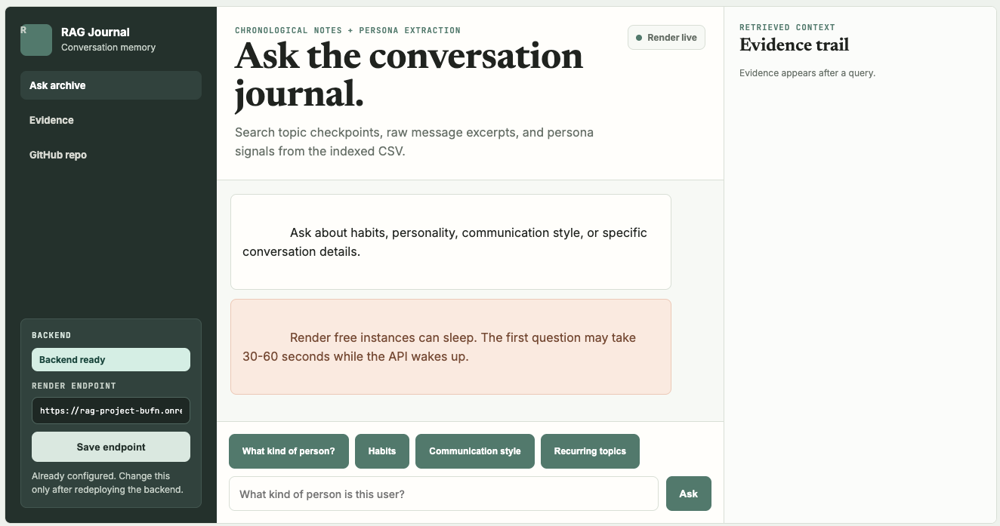
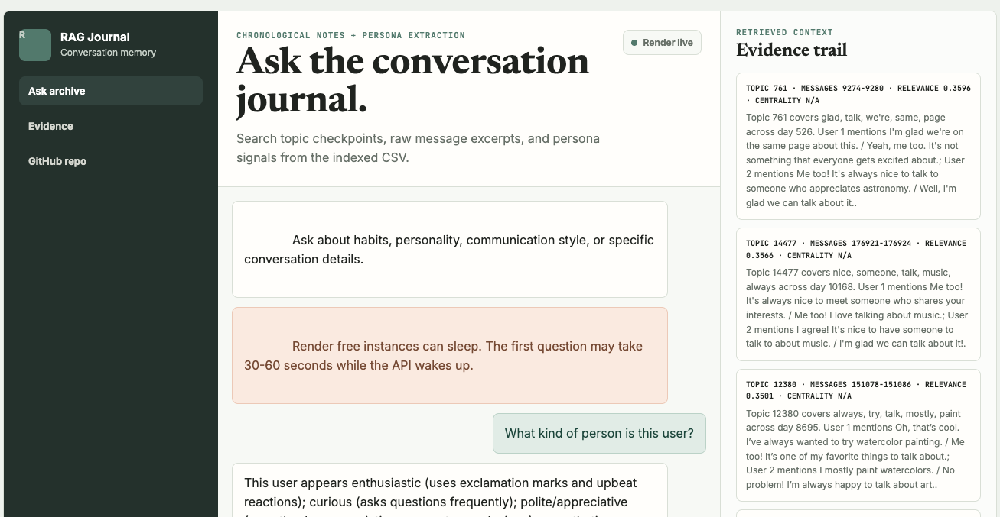
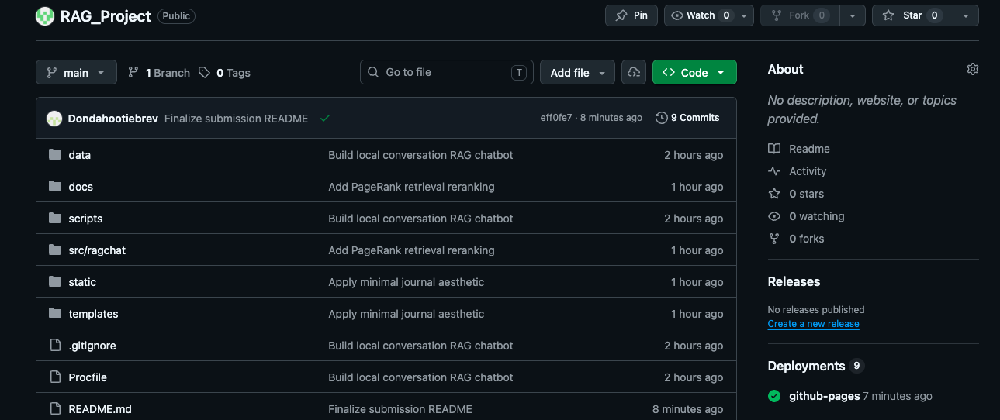

# RAG Journal: Conversation RAG + Persona Chatbot

RAG Journal is an end-to-end local RAG system for a CSV of daily conversations. It processes messages chronologically, creates topic checkpoints when the conversation changes, builds independent 100-message checkpoints, extracts an evidence-backed user persona, and serves a chatbot through a GitHub Pages frontend with a Render-hosted Flask backend.

## Submission Links

```text
GitHub Repository: https://github.com/Hootsworth/RAG_Project
Live Chatbot:      https://hootsworth.github.io/RAG_Project/
Render Backend:   https://rag-project-bufn.onrender.com
Loom Demo:         https://www.loom.com/share/dd2f25fca48b4ac6b04f755f6643ea66
```

> Note: The backend is hosted on Render Free. If the service is asleep, the first request can take 30-60 seconds while it wakes up.

## Screenshots

### Empty Chatbot State



### Chatbot With Response + Evidence



### GitHub Repository



## Key Code Blocks

### Topic Checkpoint Splitting

```python
def build_topic_checkpoints(messages: list[Message]) -> list[TopicCheckpoint]:
    checkpoints: list[TopicCheckpoint] = []
    segment: list[Message] = []
    segment_counter: Counter = Counter()
    weak_shift_streak = 0

    for message in messages:
        message_counter = keyword_counter(message.text)
        day_changed = bool(segment and message.day != segment[-1].day)
        similarity = cosine_counts(segment_counter, message_counter)
        enough_context = len(segment) >= 6
        likely_shift = enough_context and similarity < 0.055 and len(message_counter) >= 2

        if day_changed:
            previous_day_messages = [m for m in segment if m.day == segment[-1].day]
            previous_day_counter = Counter()
            for old in previous_day_messages[-6:]:
                previous_day_counter.update(keyword_counter(old.text))
            day_similarity = cosine_counts(previous_day_counter or segment_counter, message_counter)
            likely_shift = likely_shift or day_similarity < 0.12

        weak_shift_streak = weak_shift_streak + 1 if likely_shift else 0
        should_split = bool(segment and (day_changed or weak_shift_streak >= 2) and len(segment) >= 4)

        if should_split:
            checkpoints.append(_make_topic_checkpoint(len(checkpoints) + 1, segment))
            segment = []
            segment_counter = Counter()
            weak_shift_streak = 0

        segment.append(message)
        segment_counter.update(message_counter)

    if segment:
        checkpoints.append(_make_topic_checkpoint(len(checkpoints) + 1, segment))
    return checkpoints
```

### Retrieval With PageRank Reranking

```python
def _search_index(index: dict, query: str, k: int) -> list[dict]:
    query_vector = index["vectorizer"].transform([query])
    scores = cosine_similarity(query_vector, index["matrix"]).ravel()
    pagerank_scores = np.array([float(record.get("pagerank", 0.0)) for record in index["records"]])

    candidate_count = min(scores.size, max(k * 10, k))
    candidates = np.argsort(scores)[::-1][:candidate_count]
    final_scores = (0.93 * scores) + (0.07 * pagerank_scores)
    top = candidates[np.argsort(final_scores[candidates])[::-1][:k]]

    results = []
    for row in top:
        score = float(scores[row])
        if score <= 0:
            continue
        record = dict(index["records"][int(row)])
        record["score"] = round(score, 4)
        record["final_score"] = round(float(final_scores[row]), 4)
        record["centrality"] = round(float(record.get("pagerank", 0.0)), 4)
        results.append(record)
    return results
```

### Persona Extraction

```python
def build_persona(messages: list[Message], speaker: str = "User 1") -> dict:
    user_messages = [m for m in messages if m.speaker.lower() == speaker.lower()]
    facts = _extract_items(user_messages, FACT_PATTERNS, limit=40)
    habits = _extract_items(user_messages, HABIT_PATTERNS, limit=35)
    traits = _infer_traits(user_messages)
    communication = _communication_style(user_messages)
    interests = _interests(user_messages)

    return {
        "target_speaker": speaker,
        "message_count": len(user_messages),
        "habits": [h.to_dict() for h in habits],
        "personal_facts": [f.to_dict() for f in facts],
        "personality_traits": traits,
        "communication_style": communication,
        "interests": interests,
        "note": "Persona fields are rule-based and include evidence message IDs.",
    }
```

### Artifact Build Pipeline

```python
def build_artifacts(csv_path: str | Path, out_dir: str | Path = "artifacts", target_speaker: str = "User 1") -> dict:
    messages = parse_messages(csv_path)
    topics = build_topic_checkpoints(messages)
    hundreds = build_hundred_checkpoints(messages)
    chunks = build_message_chunks(messages)
    persona = build_persona(messages, speaker=target_speaker)

    topic_records = add_pagerank_scores([t.to_dict() | {"text": t.summary} for t in topics], "text")
    chunk_records = add_pagerank_scores(chunks, "text", top_n=6)
    hundred_records = [h.to_dict() | {"text": h.summary} for h in hundreds]

    joblib.dump(fit_index(topic_records, "text"), out / "topic_index.joblib")
    joblib.dump(fit_index(chunk_records, "text"), out / "chunk_index.joblib")
    joblib.dump(fit_index(hundred_records, "text"), out / "hundred_index.joblib")

    return {
        "message_count": len(messages),
        "topic_checkpoint_count": len(topics),
        "hundred_checkpoint_count": len(hundreds),
        "message_chunk_count": len(chunks),
    }
```

## Features

- Chronological message parsing from a single-column CSV
- Topic checkpointing whenever the conversation topic changes
- Independent 100-message checkpoint summaries
- Local TF-IDF retrieval over topic summaries, message chunks, and 100-message summaries
- PageRank graph reranking for better evidence ordering
- Rule-based persona extraction with evidence message IDs
- GitHub Pages chatbot frontend
- Render Flask backend API
- Suggested question chips
- Backend health/wake status
- Copy-answer button
- Evidence panel with relevance and centrality scores

## Project Structure

```text
RAG_Project/
├── data/
│   └── conversations.csv
├── docs/
│   ├── index.html
│   ├── script.js
│   └── styles.css
├── scripts/
│   ├── ask.py
│   └── build_index.py
├── src/ragchat/
│   ├── app.py
│   ├── data_loader.py
│   ├── pagerank.py
│   ├── persona.py
│   ├── pipeline.py
│   ├── retriever.py
│   ├── segmentation.py
│   ├── summarizer.py
│   └── text_utils.py
├── templates/
├── static/
├── render.yaml
├── Procfile
├── requirements.txt
└── README.md
```

## How To Run Locally

```bash
python3 -m venv .venv
source .venv/bin/activate
pip install -r requirements.txt
python scripts/build_index.py --csv data/conversations.csv --out artifacts
PORT=5055 python -m src.ragchat.app
```

Open:

```text
http://localhost:5055
```

Ask from the terminal:

```bash
python scripts/ask.py "What kind of person is this user?"
python scripts/ask.py "What are their habits?"
python scripts/ask.py "How do they talk?"
python scripts/ask.py "What did the user say about Portland?"
```

## What Gets Built

Running `scripts/build_index.py` creates local artifacts:

- `artifacts/messages.json`: parsed chronological messages
- `artifacts/topic_checkpoints.json`: topic segments with summaries
- `artifacts/hundred_checkpoints.json`: summaries for every 100 chronological messages
- `artifacts/message_chunks.json`: overlapping raw message chunks
- `artifacts/persona.json`: structured persona with evidence IDs
- `artifacts/topic_pagerank.json`: graph centrality for topic checkpoints
- `artifacts/chunk_pagerank.json`: graph centrality for message chunks
- `artifacts/*_index.joblib`: local TF-IDF indexes

No external LLM or paid API is required. The system uses Python, Flask, scikit-learn, NumPy, and local rule-based logic.

## Topic Change Detection

The CSV contains one conversation per row. The loader parses each row message by message and assigns a global chronological message ID.

Topic splitting happens in `src/ragchat/segmentation.py`.

The splitter maintains a rolling keyword counter for the current segment. For every new message, it compares the message keywords against the active segment using cosine similarity over keyword counts.

A new topic checkpoint is created when:

- the day changes and the new message is distant from the prior segment
- the rolling similarity stays low after enough context exists
- a row boundary indicates a new conversation thread

Each topic checkpoint stores:

- topic ID
- start/end message ID
- start/end day
- message count
- summary for that topic segment only
- top keywords

This avoids treating the full conversation history as one topic.

## 100-Message Checkpoints

100-message checkpoints are independent from topic checkpoints. After all messages are parsed chronologically, the system slices the global message stream into fixed windows of 100 messages and summarizes each window.

These summaries provide broader context when a query spans multiple small topic segments.

## Retrieval

Retrieval is implemented in `src/ragchat/retriever.py`.

For every question, the system searches:

- topic checkpoint summaries
- overlapping raw message chunks
- 100-message checkpoint summaries

The answer is generated from retrieved topic summaries, retrieved raw chunks, and persona data when relevant.

## PageRank Reranking

The system is still a RAG system. PageRank improves the retrieval stage only.

During indexing:

- topic checkpoints become graph nodes
- message chunks become graph nodes
- edges connect nodes with high TF-IDF cosine similarity
- PageRank gives each node a centrality score

At query time:

```text
candidate_pool = top query-similar records
final_score = 0.93 * query_similarity + 0.07 * pagerank_centrality
```

TF-IDF still controls relevance. PageRank only reranks already-relevant candidates so central but unrelated memories do not override the query.

The frontend shows both:

- `relevance`: query similarity
- `centrality`: PageRank score

## Persona Extraction

Persona extraction is implemented in `src/ragchat/persona.py`.

It extracts structured JSON for `User 1`:

- habits
- personal facts
- personality traits
- communication style
- interests

Persona signals are rule-based and evidence-backed. Extracted facts and habits include:

- value
- evidence message ID
- source message excerpt

The system avoids guessing when signal is weak.

## Chatbot Frontend

The frontend is hosted with GitHub Pages from the `docs/` folder:

```text
https://hootsworth.github.io/RAG_Project/
```

Frontend features:

- minimal journal-style UI
- suggested question chips
- backend status check
- Render wake-up messaging
- copy answer button
- retrieved evidence panel
- relevance and centrality labels

The frontend calls the Render backend:

```text
https://rag-project-bufn.onrender.com
```

## Backend Hosting

The backend is a Flask app hosted on Render.

Render build command:

```bash
pip install -r requirements.txt && python scripts/build_index.py --csv data/conversations.csv --out artifacts
```

Render start command:

```bash
gunicorn src.ragchat.app:app
```

Health check:

```text
https://rag-project-bufn.onrender.com/health
```

Expected response:

```json
{"status":"ok"}
```

Final Loom demo:

```text
https://www.loom.com/share/dd2f25fca48b4ac6b04f755f6643ea66
```
